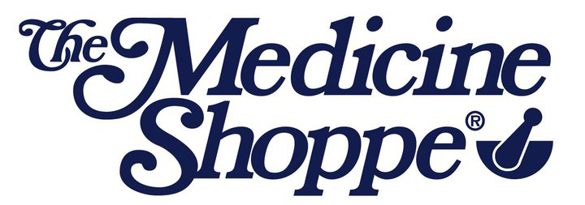

    <!--
    
    
    
     -->

[

# C-ll Tracking

> This repo contains a web based application to track orders inventory of Schedule ll substances.

**Check it out!**

---

## Table of Contents

- [Installation](#Installation)
- [Features](#Features)
- [Usage](#Usage)
- [Tests](#Tests)
- [Contributing](#Contributing)
- [Team](#Team)
- [Support](#Support)

---

## Installation

- Pending addition of installer
- Installer photo
- Needs to include postgreSQL setup (username/password)
- Needs to allow for a logo to be added, with medicine shoppe as default
- Optional to include users
- Reinstall option to add or remove users

## Features
- Tracking of C-ll controlled drugs
- Tracking of Purchases, Prescriptions, and Audits.
- Editing or deletions of existing logs
- Write to an Excel equivalent database file
  - Current master branch does not work for this feature. Pending https://github.com/360EntSecGroup-Skylar/excelize/issues/625.

## Usage
- To add an order
  - Select type of order to add
  - Enter data required
    - Note: 'Real Count' is not a required field
  - Submit the order
- To edit or delete an order
  - Click on the order to update
  - To edit:
    - Edit the order quantity or script if desired
    - Select submit 
  - To delete:
    - Select delete
    - When prompted again, select delete
    
---

# Tests

- Include updates about what the unit tests cover (coverage details)
- Include updates about the integration tests
 
---

## Contributing

> For those interested in contributing to the project.

### Step 1

- **Option 1**
    - 🍴 Fork this repo!

- **Option 2**
    - 👯 Clone this repo to your local machine using `https://github.com/bconn98/DrugRecord.git`

### Step 2
- **Create a branch!** Please do not use the master branch for development.

### Step 3

- **HACK AWAY!** 🔨🔨🔨

---

## Team

| <a href="https://github.com/bconn98" target="_blank">**Github Profile**</a> 
| :---: |
|  
| <a href="http://github.com/bconn98" target="_blank">`github.com/bconn98`</a> 

---

## Support

Reach out to me at one of the following places!

<!-- - Website at <a href="http://fvcproductions.com" target="_blank">`fvcproductions.com`</a> -->
- Twitter at <a href="https://twitter.com/connbryan" target="_blank">`@connbryan`</a>
- Facebook at <a href="https://www.facebook.com/bryan.conn.39/" target="_blank"> `bryan.conn.39` </a>
- Instagram at <a href="https://www.instagram.com/bconn98/" target="_blank"> `bconn98` </a>
- Github at <a href="http://github.com/bconn98" target="_blank">`bconn98`</a>
